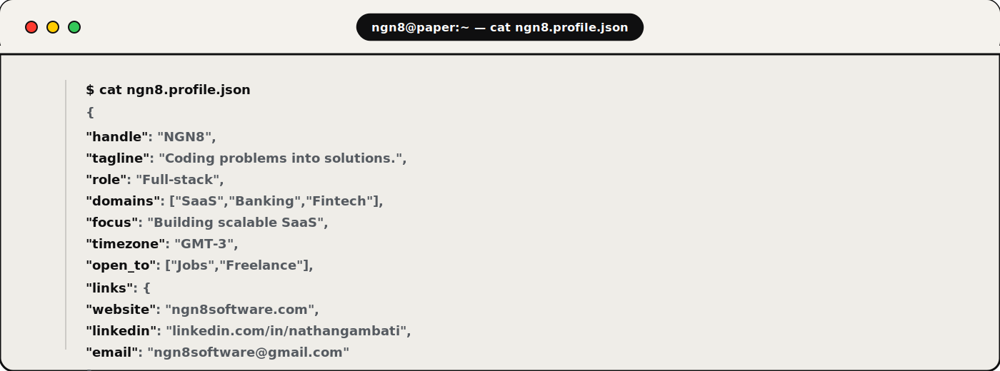
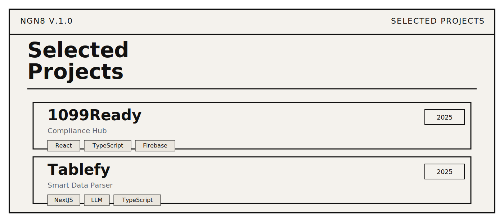
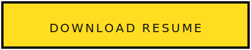
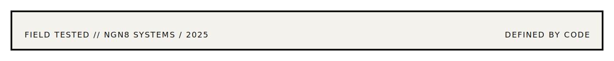

  

  <a href="https://ngn8software.com">WEBSITE</a>&nbsp;&nbsp;•&nbsp;&nbsp;
  <a href="https://www.linkedin.com/in/nathangambati">LINKEDIN</a>&nbsp;&nbsp;•&nbsp;&nbsp;
  <a href="mailto:ngn8software@gmail.com">EMAIL</a>

 

  

 

  

  <b>1099Ready</b> — https://1099ready.app 
  <b>Tablefy</b> — https://tablefy.net

 

  

  

### Employer?

  

  

